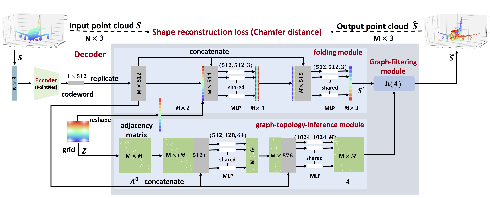

<!--
Copyright (C) 2018-2019, 2023 Mitsubishi Electric Research Laboratories (MERL)

SPDX-License-Identifier: AGPL-3.0-or-later
-->

# FoldingNet++

## Features

This repository contains the implementation of: FoldingNet++ in the paper: Deep Unsupervised Learning of 3D Point Clouds
via Graph Topology Inference and Filtering. https://arxiv.org/pdf/1905.04571.pdf <br>



### Abstract

We propose a deep autoencoder with graph topology inference and filtering to achieve compact representations of
unorganized 3D point clouds in an unsupervised manner. Many previous works discretize 3D points to voxels and then use latticebased methods to process and learn 3D spatial information; however, this leads to inevitable discretization errors. In this work, we try to handle raw 3D points without such compromise. The proposed networks follow the autoencoder framework with
a focus on designing the decoder. The encoder of the proposed networks adopts similar architectures as in PointNet, which
is a well-acknowledged method for supervised learning of 3D point clouds. The decoder of the proposed networks involves
three novel modules: the folding module, the graph-topologyinference module, and the graph-filtering module. The folding
module folds a canonical 2D lattice to the underlying surface of a 3D point cloud, achieving coarse reconstruction; the graphtopology-inference module learns a graph topology to represent pairwise relationships between 3D points, pushing the latent code to preserve both coordinates and pairwise relationships of points in 3D point clouds; and the graph-filtering module couples the above two modules, refining the coarse reconstruction through a learnt graph topology to obtain the final reconstruction. The proposed decoder leverages a learnable graph topology to push the codeword to preserve representative features and further improve the unsupervised-learning performance. We further provide theoretical analyses of the proposed architecture. We provide an upper bound for the reconstruction loss and further show the superiority of graph smoothness over spatial smoothness as a prior to model 3D point clouds. In the experiments, we validate the proposed networks in three tasks, including 3D point cloud reconstruction, visualization, and transfer classification. The experimental results show that (1) the proposed networks outperform the state-of-the-art methods in various tasks, including reconstruction and transfer classification; (2) a graph topology can be inferred as auxiliary information without specific supervision on graph topology inference; (3) graph filtering refines the reconstruction, leading to better performances; and (4) designing a powerful decoder could improve the unsupervisedlearning performance, just like a powerful encoder.

## Installation


### Requirements

* Python 3.6
* Pytorch 0.4.0
* argparse
* numpy

## Usage

### Datasets
Please download the datasets for training and testing: https://doi.org/10.5281/zenodo.8215703.

Note that we provide the datasets with covariance matrices for knn = 20, you can also process the datasets shapenet and modelnet with different number of neighbors (k) with the provided code: classification_data_process.py. Please make sure you train/test with consistency, which means if you train with weighted covariance calculated from knn = 20 neighboring points, please also test with weighted covariance calculated from knn = 20 neighboring points.

Warning: if you train and test with different version, the code will not break but you may get unexpected results.

### Training & Testing
* Training:

```shell
python traintest_foldingnetplus.py \
-0 ../../datasets/weight_data/shapenet_weight_cov_knn_20weight.npy \ # train with covariance information
-1 ../../datasets/test_minor.npy -e 300
```

* Testing:

```shell
python traintest_foldingnetplus.py \
-0 ../../datasets/weight_data/train_minor.npy \
-1 ../../datasets/modelNet40_train_2048.npy or other datasets \
--restore_checkpoint_filename your_neural_net_name.pkl \
-e 1
```

* SVM
The label and codeword information will be saved in the python file each time you test with your trained net.

We use linear SVM here to calculate the transfer classification accuracy as all the previous works.
https://scikit-learn.org/stable/modules/generated/sklearn.svm.SVC.html

## Citation

If you use the software, please cite the following ([TR2020-004](https://merl.com/publications/TR2020-004)):

```
@article{Chen2020jan,
author = {Chen, Siheng and Duan, Chaojing and Yang, Yaoqing and Feng, Chen and Li, Duanshun and Tian, Dong},
title = {Deep Unsupervised Learning of 3D Point Clouds via Graph Topology Inference and Filtering},
journal = {IEEE Transactions on Image Processing},
year = 2020,
pages = {3183--3198},
month = jan,
doi = {10.1109/TIP.2019.2957935},
url = {https://www.merl.com/publications/TR2020-004}
}
```

## Contact

Tim K Marks (<tmarks@merl.com>)

## Contributing

See [CONTRIBUTING.md](CONTRIBUTING.md) for our policy on contributions.

## License

Released under `AGPL-3.0-or-later` license, as found in the [LICENSE.md](LICENSE.md) file.

All files:

```
Copyright (C) 2018-2019, 2023 Mitsubishi Electric Research Laboratories (MERL).

SPDX-License-Identifier: AGPL-3.0-or-later
```
